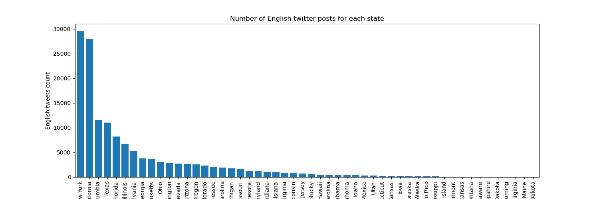
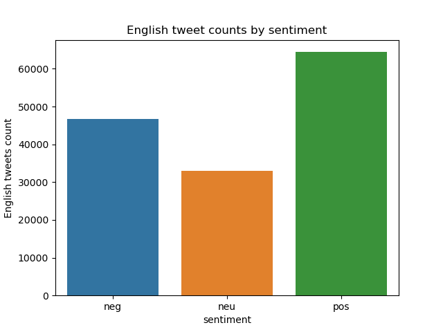
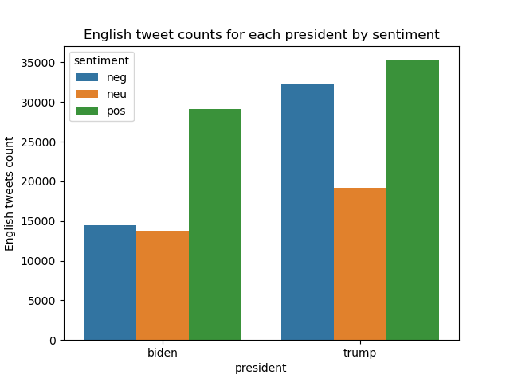
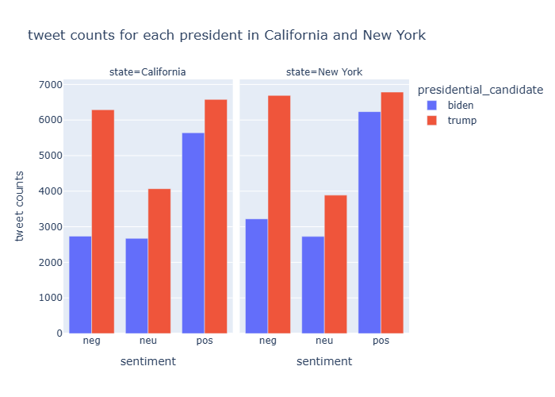
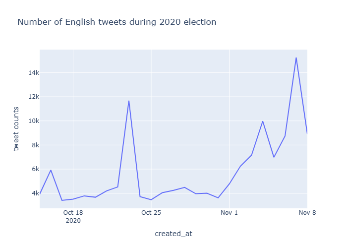
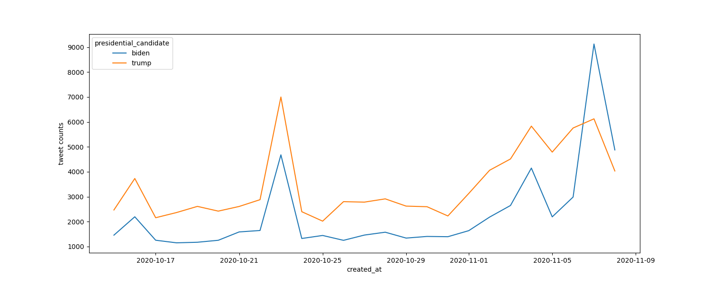
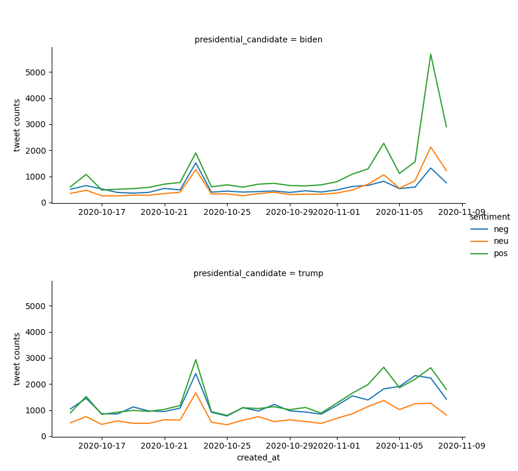
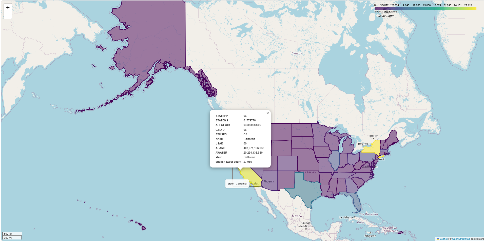

# 2020 Election tweet analysis

## About
This project explores 2020 U.S. Presidential Election by analyzing the sentiment of Twitter posts regarding candidates Donald Trump and Joe Biden. Utilizing a dataset of over 1.5 millions of tweets, I developed a research to study the sentiment of posts and the distribution of sentiment categories, focusing on 2 states where most of the posts came from: California and New York. The analysis also incorporates a temporal dimension, tracking how sentiment fluctuated in real-time as the election progressed. 

## Tech stack
Python, PyPlot, Mathplotlib, Pandas, NLTK, Airflow, BigQuery, Tableau, Geopandas.

## Approach 

### Data Cleaning and Transformation
Since I am only interested in tweets that originated from USA, I dropped all rows that contained tweets from other countries. For the tweets that originated from USA, I only keep tweets that were written in English. In order to perform language detection, I use pycld2. I create a new column called lang that contains language code representing the language the tweets were written in. I then dropped tweets that were not written in English. Sentiment analysis at this point has become an easy task since we don't have to deal with any language but English. To conduct sentiment analysis, I leverage module vader of library NLTK. Before applying sentiment analysis on each tweet, I remove all irrelevant words and symbols from each tweet. As a result, The tweets now only contain alphabetical characters. Furthermore, I lemmatize the words in each tweet (reducing words to root form) using WordNetLemmatizer. This operation reduces a lot of unique texts in each tweet. After having cleansed all the tweets, I feed them into SentimentIntensityAnalyzer. This operation takes over 30 seconds. After exploratory data analysis phase, I end up with 144201 rows. 

### Analysis
I first look at the twitter post distribution by state.
 

 
New York and California were the 2 states that had the most English twitter posts in USA in 2020. This means that these states have a lot data for us to play with and can reveal some interesting patterns. We will go back to these 2 states later. 

 
Since I conduct sentiment analysis, I want to see the distribution of the sentiment categories: Positive, Neutral, Negative. Below is the bar plot of the sentiment category distribution.
 

 

 
We then want to look into sentiment of posts that mentioned 2 candidates: Trump and Biden.
 

 
Looking at the bar chart, we can tell there were more posts that mentioned Trump. Also number of posts with negative sentiment that mentioned Trump was as high as the number of of ones with positive sentiments. Based on number of English Twitter posts, we can see that Trump received way more attention than Biden but the number of English Twitter posts with negative sentiment was way higher.

 
We now shift our attention to the 2 states that had the highest number of Twitter posts written in English.
 

 
These charts once again confirm that Trump was a very popular candidate. Looking at distribution of posts for each of sentiment categories, it is very obvious that Trump was mentioned in way more posts than Biden and the political perspectives were highly polarized. There was only a small number of posts that were neutral.

 
We now look at how the number of posts changed during the election for each president.
 

 
We can see a very sharp increase in number of posts at 1 point near Oct 25 and during the period from Nov 1 to Nov 8. The number of posts reached its peak near Nov 8 when it surpassed 14000. Based on this chart, we can infer that things were getting heated during these times and we would like to know the sentiment of Twitter users toward the presidential candidates.
 

 
As a effort to dive deeper into how numbers of posts changed each day, we look at the numbers of posts that mentioned Biden and Trump 

 
This graph confirms that our analysis on the previous graph is correct: The numbers of posts rose quickly near Oc 25 and during Nov 1 to Nov 8. This graph gives us another interesting insight: Biden was mentioned less times than Trump for most of days. However, after Nov 5, the numbers of posts that mentioned Biden dwarfed the ones that mentioned Trump. 

 
Now, we want to look at how sentiment of posts changed over time for each president.
 

 
Sentiment towards each president was polarized, generally speaking. Again,we can see that sentiment toward Trump was very polarized. The numbers of negative and positive posts were very close. Regarding Biden, there were more posts with positive sentiment during this period of time. And after Nov 5, positive posts that mentioned Biden appeared more frequently which eventually made him more popular than Trump.

### Visualization
Map built with Geopandas that showed post distribution in each state. Here is the screenshot of it. I have also attached the interactive html map to this repo:
 

### Link to visualization in HTML

[Click here to view the interactive twitter posts distribution interactive map](./usa_2020_election_tweet_count.html)